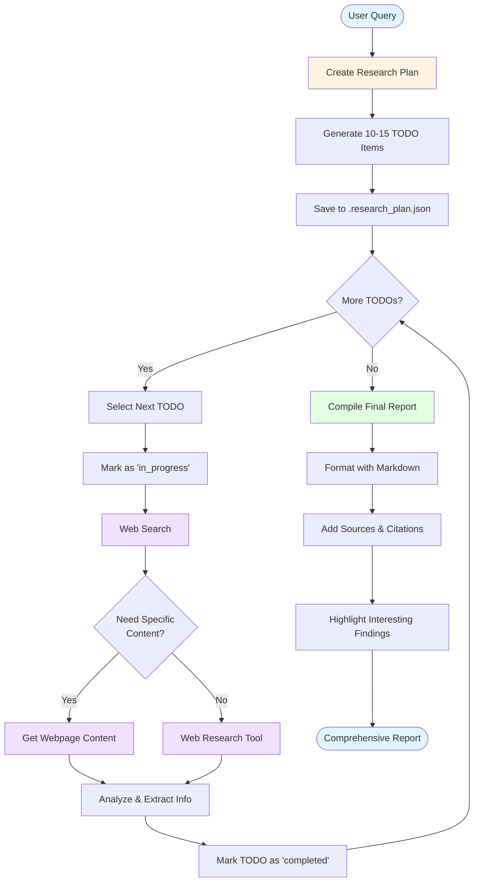

<p align=center>

</p>
<h1 align="center">Deep Research approach</h1>

A comprehensive **AI-powered research system** that conducts thorough investigations on any topic using structured planning, multi-source web research, and professional report generation.

## ⚡ Quick Start

```bash
# Install dependencies
pip install -r requirements.txt

# Set up your API keys in .env
cp .env.template .env
# Edit .env with your keys

# Run a research query
python main.py "Arkel.ai french company"

# With custom settings (fast research)
python main.py "Tesla sustainability initiatives" --provider cerebras --max-iter 75

# Deep analysis with reasoning mode
python main.py "Impact of quantum computing on cryptography" --reasoning --max-iter 100
```

## 🎯 Overview

The Deep Research System is an autonomous AI research assistant built with CrewAI that can:

- **Plan** research investigations with structured TODO lists
- **Search** the web using advanced AI-powered search (Exa AI)
- **Extract** full content from specific webpages
- **Analyze** information from multiple sources
- **Synthesize** findings into comprehensive, well-formatted reports

## ✨ Key Features

- 🎯 **Interactive CLI** - Command-line interface with customizable parameters
- 📊 **Reactive Dashboard** - Live-updating display that refreshes in place (no scrolling!)
- 🔄 **Status Tracking** - Visual status indicators (⏳ pending → 🔄 in_progress → ✅ completed)
- 🤖 **Multi-Tool Research** - Web search, content extraction, and deep analysis
- 📝 **Structured Planning** - Automatic breakdown into 10-15 actionable steps
- 📄 **Professional Reports** - Markdown-formatted output with citations
- 🎨 **Highly Customizable** - Adjust model, provider, depth, and creativity via CLI
- ⚡ **Provider Selection** - Choose specific LLM providers (Cerebras, OpenAI, Anthropic, etc.)
- 🧠 **Reasoning Mode** - Enable extended reasoning for complex topics (up to 8192 tokens)
- 🔇 **Clean Output** - Third-party logs suppressed by default

## 🏗️ Architecture

### Components

1. **Research Agent** - A unified AI agent that handles planning, research, and writing
2. **Research Tools** - Four specialized tools for different research tasks
3. **Task Orchestration** - CrewAI-based workflow management
4. **Persistent Planning** - JSON-based TODO tracking system

### Tools

| Tool                     | Purpose                        | Key Features                                                                                                                             |
| ------------------------ | ------------------------------ | ---------------------------------------------------------------------------------------------------------------------------------------- |
| `update_research_plan` | Create and manage TODO lists   | - Persistent JSON storage- Status tracking (pending/in_progress/completed)- Merge updates                                                |
| `web_search_tool`      | Search the web for information | - AI-powered search (Exa AI)- Domain filtering- Category filtering (company, news, linkedin, pdf, etc.)- Search types (auto/neural/deep) |
| `get_webpage_content`  | Extract full webpage content   | - Live crawling- AI summaries- Link extraction- Subpage crawling                                                                         |
| `web_research_tool`    | Deep-dive research on topics   | - Extended content analysis- Multi-source aggregation                                                                                    |

## 🔄 Research Workflow



## 📋 How It Works

### 1. **Planning Phase**

When you submit a research query, the agent:

1. Analyzes the query to understand intent and scope
2. Breaks it down into 10-15 specific, actionable research steps
3. Creates a TODO list using `update_research_plan`
4. Saves the plan to `.research_plan.json`

**Example TODO Structure:**

```json
{
  "explanation": "Creating research plan for Arkel.ai",
  "updated_at": "2025-11-16 13:00:00",
  "todos": [
    {
      "id": "step-1",
      "status": "pending",
      "content": "Research company background and history"
    },
    {
      "id": "step-2",
      "status": "pending",
      "content": "Identify key products and services"
    }
  ]
}
```

### 2. **Research Phase**

For each TODO item, the agent:

1. **Marks the item as "in_progress"**
2. **Searches the web** using `web_search_tool`:
   - Can filter by domain (e.g., only LinkedIn)
   - Can filter by category (company, news, linkedin profile, pdf)
   - Can choose search type (auto, neural, deep)
3. **Extracts content** from promising URLs using `get_webpage_content`:
   - Fetches full text content
   - Gets AI-generated summaries
   - Extracts related links
4. **Deep-dives** using `web_research_tool` for specific topics
5. **Marks the item as "completed"**

**Tool Usage Examples:**

```python
# Search for company information
web_search_tool(
    query="Arkel.ai company",
    category="company",
    search_type="neural"
)

# Get full content from specific URLs
get_webpage_content(
    urls=["https://arkel.ai", "https://arkel.ai/about"]
)

# Search LinkedIn for key persons
web_search_tool(
    query="Arkel.ai founders CEO",
    include_domains=["linkedin.com"],
    category="linkedin profile"
)
```

### 3. **Synthesis Phase**

After completing all research TODOs, the agent:

1. Compiles all gathered information
2. Organizes findings by topic
3. Creates a structured markdown report with:
   - Clear sections and headers
   - Bullet points and tables
   - Citations for all sources
   - Interesting findings highlighted

**Report Structure:**

```markdown
# [Report Title]

## Executive Summary
...

## Main Findings
### Topic 1
...
### Topic 2
...

## Interesting Findings
- Surprising fact 1
- Surprising fact 2

## Sources
1. [Source Title](URL)
2. [Source Title](URL)
```

## 🚀 Getting Started

### Prerequisites

- Python 3.11+
- OpenAI API key (or compatible API via OpenRouter)
- Exa AI API key

### Installation

1. **Clone the repository**

```bash
git clone <repository-url>
cd deep-research
```

2. **Install dependencies**

```bash
pip install -r requirements.txt
```

3. **Set up environment variables**

Create a `.env` file:

```env
OPENAI_API_KEY=your_openai_api_key
OPENAI_BASE_URL=https://api.openai.com/v1  # or your OpenRouter URL
EXAAI_API_KEY=your_exa_api_key
```

### Configuration

**Environment Variables:**

The system reads configuration from `.env`:

```env
OPENAI_API_KEY=your_openai_api_key
OPENAI_BASE_URL=https://api.openai.com/v1  # or your OpenRouter URL
EXAAI_API_KEY=your_exa_api_key
```

**Runtime Configuration:**

Use command-line arguments to configure behavior without editing code:

```bash
python main.py "Your query" --model MODEL --max-iter N --temperature T
```

See `python main.py --help` for all available options.

### Usage

**Basic Usage:**

```bash
# Use default query
python main.py

# Research a specific topic
python main.py "Your research topic here"

# Research with custom model
python main.py "Exaion French company" --model openrouter/openrouter/anthropic/claude-3.5-sonnet

# Research with custom settings
python main.py "AI in healthcare" --max-iter 100 --temperature 0.2
```

**Command-Line Arguments:**

```bash
python main.py --help
```

Available options:

- `query` - Research topic (positional argument, optional)
- `--model` - LLM model to use (default: claude-haiku-4.5)
- `--max-iter` - Maximum agent iterations (default: 50)
- `--temperature` - LLM temperature for creativity (default: 0.0)
- `--provider` - Specify provider(s) to use (e.g., cerebras, openai, anthropic)
- `--reasoning` - Enable reasoning mode for deeper analysis (default: disabled)
- `--verbose` - Enable verbose logging output (default: disabled)

**Examples:**

```bash
# Quick research with fewer iterations
python main.py "Tesla stock analysis" --max-iter 30

# Creative research with higher temperature
python main.py "Future of renewable energy" --temperature 0.7

# Use a more powerful model
python main.py "Quantum computing applications" \
  --model openrouter/openrouter/anthropic/claude-3.5-sonnet \
  --max-iter 75

# Enable verbose logging for debugging
python main.py "Research topic" --verbose

# Use specific provider (e.g., Cerebras for speed)
python main.py "AI market analysis" --provider cerebras

# Use multiple providers as fallback
python main.py "Research topic" --provider "cerebras,openai"

# Enable reasoning mode for deeper analysis
python main.py "Complex research topic" --reasoning

# Combined: complex research with reasoning, custom provider, and more iterations
python main.py "Quantum computing applications in drug discovery" \
  --reasoning \
  --provider anthropic \
  --max-iter 75 \
  --temperature 0.2
```

The system will:

1. Clean up any previous research plan (each session starts fresh)
2. Create a new research plan
3. Display TODO list updates in real-time as research progresses
4. Show status changes (⏳ pending → 🔄 in_progress → ✅ completed)
5. Generate and display a comprehensive final report

**Real-Time Monitoring:**

The system displays a **reactive dashboard** that updates in place (no scrolling):

```
📋 Research Plan Monitor
============================================================

⏱️  Updated: 2025-11-16 13:30:45
📝 Starting research on company background
------------------------------------------------------------

📊 Progress: 10 tasks total
   🔄 in_progress: 1
   ⏳ pending: 7
   ✅ completed: 2

📋 Current Plan:
    1. ✅ [completed   ] Research company background and history
    2. ✅ [completed   ] Identify key products and services
    3. 🔄 [in_progress ] Find information about leadership team
    4. ⏳ [pending     ] Analyze market position
   ...
============================================================
```

The display **updates in place every 2 seconds** - no scrolling, just live status changes! Tasks automatically move through: ⏳ → 🔄 → ✅

> **Technical Note**: The reactive display uses ANSI escape codes (`\033[s`, `\033[u`, `\033[J`) to save/restore cursor position and clear content, creating a dashboard-like experience. This works in all modern terminals (bash, zsh, PowerShell, etc.).

### Logging and Debugging

The system uses a **hybrid approach** with both logging and print statements:

- **Print statements**: User-facing output (banners, progress, reports)
- **Logging system**: Diagnostic information, errors, system events

**Third-party library logs** (LiteLLM, httpx, OpenAI) are **suppressed by default** to keep output clean.

**Enable verbose logging for debugging:**

```bash
python main.py "Research topic" --verbose
```

This will show detailed logs including third-party library information:

```
2025-11-16 13:30:00 - deep-research - INFO - Deep Research System initialized - Query: 'Research topic'
2025-11-16 13:30:00 - deep-research - INFO - Configuration: model=claude-haiku-4.5, max_iter=50, temperature=0.0
2025-11-16 13:30:01 - deep-research - INFO - Starting real-time plan monitoring
2025-11-16 13:30:01 - deep-research - INFO - Plan monitoring thread started
2025-11-16 13:30:02 - deep-research - INFO - Starting research execution
2025-11-16 13:30:02 - LiteLLM - INFO - LiteLLM completion() model= openrouter/anthropic/claude-haiku-4.5
...
```

**Redirect logs separately:**

```bash
# Save report to file, see logs in terminal
python main.py "topic" > report.md

# Save logs to file, see report in terminal
python main.py "topic" 2> logs.txt

# Save both separately
python main.py "topic" > report.md 2> logs.txt
```

## 🛠️ Advanced Features

### Custom Search Parameters

**Domain-Specific Search:**

```python
web_search_tool(
    query="AI research papers",
    include_domains=["arxiv.org", "paperswithcode.com"]
)
```

**Category Filtering:**

```python
web_search_tool(
    query="company financial report",
    category="pdf"
)
```

**Search Algorithm Selection:**

- `auto`: Let Exa choose the best algorithm
- `neural`: AI-powered semantic search
- `deep`: Deep web crawling for comprehensive results

### TODO Management

**Create Initial Plan:**

```python
update_research_plan(
    todos=[
        {"id": "step-1", "status": "pending", "content": "Research X"},
        {"id": "step-2", "status": "pending", "content": "Research Y"},
    ],
    explanation="Creating initial plan"
)
```

**Update Status:**

```python
# Mark as in progress
update_research_plan(
    todos=[{"id": "step-1", "status": "in_progress"}],
    explanation="Starting step 1"
)

# Mark as completed
update_research_plan(
    todos=[{"id": "step-1", "status": "completed"}],
    explanation="Completed step 1"
)
```

## 📊 Research Quality Features

### Multi-Source Verification

- The agent gathers information from multiple sources
- Cross-references findings for accuracy
- Documents contradictions when found

### Source Citation

- All information is cited with source URLs
- Sources include titles, authors, and publication dates
- Easy to verify and follow up on any claim

### Transparent Process

- TODO list shows exactly what's being researched
- Real-time status updates
- Clear separation of findings by research phase

## 📁 Project Structure

```
deep-research/
├── main.py                    # Main entry point
├── requirements.txt           # Python dependencies
├── .env                       # Environment variables (not in git)
├── .research_plan.json       # Current research plan (auto-generated, cleaned each run)
├── README.md                 # This file
├── app/
│   ├── __init__.py
│   └── config.py             # Configuration and logging
└── tools/
    ├── __init__.py
    ├── plan.py               # Research planning tool
    ├── web_search.py         # Web search and content tools
    └── web_research.py       # Deep research tool

```

## 🔧 Customization

### Adjust Research Depth

Control research depth via the `--max-iter` parameter:

```bash
# Quick research (fewer steps)
python main.py "Your topic" --max-iter 25

# Standard research
python main.py "Your topic" --max-iter 50

# Deep research (more thorough)
python main.py "Your topic" --max-iter 100
```

The system generates 10-15 TODO items and the max-iter controls how many research actions can be taken.

### Change LLM Model

Use different models based on your needs:

```bash
# Fast and cost-effective (default)
python main.py "Your topic" --model openrouter/openrouter/anthropic/claude-haiku-4.5

# More capable and thorough
python main.py "Your topic" --model openrouter/openrouter/anthropic/claude-3.5-sonnet

# Other supported models
python main.py "Your topic" --model openrouter/openrouter/openai/gpt-4
```

### Adjust Creativity

Control the LLM's creativity with temperature:

```bash
# Deterministic (factual research)
python main.py "Your topic" --temperature 0.0

# Balanced
python main.py "Your topic" --temperature 0.3

# More creative (exploratory research)
python main.py "Your topic" --temperature 0.7
```

### Select Provider

Control which LLM provider to use (when using OpenRouter or similar services):

```bash
# Automatic provider selection (default)
python main.py "Your topic"

# Use Cerebras for ultra-fast responses
python main.py "Your topic" --provider cerebras

# Use specific provider
python main.py "Your topic" --provider openai
python main.py "Your topic" --provider anthropic

# Multiple providers as fallback (tries in order)
python main.py "Your topic" --provider "cerebras,openai,anthropic"
```

**Common Providers:**
- `cerebras` - Ultra-fast inference, great for quick research
- `openai` - GPT models, balanced performance
- `anthropic` - Claude models, excellent reasoning
- `together` - Open source models
- Leave empty for automatic selection based on model

### Enable Reasoning Mode

Enable extended reasoning for more thorough analysis (requires compatible models):

```bash
# Standard mode (faster, direct responses)
python main.py "Your topic"

# Reasoning mode (deeper analysis, step-by-step thinking)
python main.py "Your topic" --reasoning
```

**When to use reasoning mode:**
- ✅ Complex research topics requiring deep analysis
- ✅ Technical or scientific subjects
- ✅ Multi-faceted questions with nuanced answers
- ✅ When accuracy is more important than speed

**Note:** Reasoning mode allocates up to 8192 tokens for internal reasoning, which helps the model think through problems more thoroughly but may increase processing time.

## 🎯 Best Practices

1. **Clear Queries**: Provide specific, well-defined research topics
2. **Domain Hints**: Include relevant domains or contexts in your query
3. **Review Progress**: Monitor `.research_plan.json` during long research sessions
4. **Verify Sources**: Always check the sources cited in the final report
5. **Iterative Refinement**: Run multiple research sessions for complex topics

## 📝 Example Output

**Command:**

```bash
python main.py "Arkel.ai french company"
```

**Console Output:**

```
============================================================
🔍 Deep Research System
============================================================
Query: Arkel.ai french company
Model: openrouter/openrouter/anthropic/claude-haiku-4.5
Max Iterations: 50
Provider: cerebras
============================================================

📋 Research Plan Monitor
============================================================
🚀 Starting Deep Research...
============================================================

⏱️  Updated: 2025-11-16 13:30:15
📝 Creating initial research plan for Arkel.ai

------------------------------------------------------------
📊 Progress: 12 tasks total
   ⏳ pending: 12

📋 Current Plan:
    1. ⏳ [pending     ] Research company background and history
    2. ⏳ [pending     ] Identify key products and services
    3. ⏳ [pending     ] Find key leadership and team
    ... (updates in real-time as research progresses)
============================================================

... (plan updates continue as tasks are completed)

⏱️  Updated: 2025-11-16 13:35:42
📝 Completed all research tasks

------------------------------------------------------------
📊 Progress: 12 tasks total
   ✅ completed: 12

============================================================
✨ RESEARCH COMPLETED
============================================================

📄 Final Report:

# Arkel.ai: French AI Company Analysis

## Executive Summary
...

## Company Background
...

## Interesting Findings
...

## Sources
1. [Arkel.ai Official Website](https://arkel.ai)
2. ...

============================================================
✅ Research completed at 2025-11-16 13:36:00
============================================================
```

**Key Features:**

- **Real-time plan updates** showing progress every 2 seconds
- **Status emojis** (⏳ pending, 🔄 in_progress, ✅ completed)
- **Progress summary** with task counts by status
- **Detailed task list** showing current state of all TODOs
- **Final comprehensive report** displayed at the end

## 🤝 Contributing

Contributions are welcome! Areas for improvement:

- Additional research tools
- Better error handling
- More sophisticated planning algorithms
- Export formats (PDF, HTML)
- Research templates for common use cases
